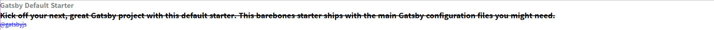

# React기반 Gatsby로 블로그 만들기

## 1. JAM Stack

>  JAM Stack이란, Javascript, API, MarkUp Stack의 약자로 자바스크립트와 API, HTML이나 CSS등을 칭하는 MarkUp으로 이루어진 웹 구성 방법
>
> 더 빠르고 안전하며 스케일링하기 쉬운 웹을 만들기 위해 디자인된 아키텍쳐


* 기존 웹사이트 방식은 대부분 서버에서 데이터 베이스 또는 CMS(Content Management System)로부터 추출한 데이터를 프론트엔드에 뿌려주는 방식 -> 복잡하다
* JAM Stack은 기존 웹사이트 방식과 다르게 절차가 매우 간단
* 각종 마크업 요소와 다양한 API를 통해 만든 정적 웹사이트를 Pre-Render한 것을 CDN(Content Delivery Networ)을 통해 웹사이트를 열람할 수 있다


## JAM Stack 장점

1. 기존 방식에 비해 더 빠르게 웹사이트를 제공할 수 있다
   * 렌더링할 화면들을 모두 Pre-Render하여 제공되어 그만큼 사용자에게 화면 보여주는 시간을 단축한다
   * 첫 응답을 받기까지 걸리는 TTFB(Time to First Byte)를 최소화하는 데에는 미리 빌드 된 파일을 CDN을 통해 제공한다 (가장 나은 방법)
2. 안전한 웹 사이트를 제공한다
   * JAM Stack은 API를 통해 정적 사이트를 생성함
   * 여기서 사용되는 API는 각 프레임워크에서의 마이크로 서비스로서 사이트 생성을 위한 프로세서가 추상화되어있기 때문에 공격 노출 범위가 감소하게 된다
3. 스케일링하기 쉬운 웹사이트를 제공한다
   * 정적 웹 사이트에서의 스케일링은 더 많은 지역에서 홈페이지 제공할 수 있게 하는 의미인데ㅡ 미리 빌드된 파일 제공을 담당하는 CDN이 그 역할을 해낸다


## 왜 Gatsby


* React기반 프레임워크, Next.js가 1위, Gatsby가 2위
* 왜 1위인 Next.js안쓰고 Gatsby를 쓰는가?
  * Next.js는 정적 사이트 생성기능도 있지만 주로 서버 사이드 렌더링을 위해 사용하는 프레임워크, 즉 서버와 통신을 해 요청을 받을때마다 동적으로 웹사이트를 생성
  * Gatsby는 서버없이 오로지 정적 사이트 생성을 위해 사용하는 프레임워크 => 블로그, 소개페이지, 포트폴리오 등에 많이 사용됨
  * 블로그 개발이 목적이어서 Gatsby 사용 


## Gatsby & GraphQL

### Gatsby

> Gatsby는 React를 사용하는 `JAM Stack 기반 프레임워크`

### GraphQL

> 페이스북에서 개발한 쿼리 언어

* 각각의 엔드 포인트에서 고정된 데이터를 받을 수 있는 Rest API

* 그와 다르게 GraphQL은 단일 엔드포인트에서 원하는 데이터만을 받을 수 있다는 장점을 가지고 있음

* Query를 통해 데이터를 받아올 수 있으며 이외에도 데이터 변경을 위한 Mutation, 실시간 기능을 위한 Subscription이 있음

  ```
  query getHeroInfo {
  	hero {
  		name
  		age
  		ability
  	}
  }
  ```

* [Gatsby 공식 홈페이지에서의 GraphQL 설명]: https://www.gatsbyjs.com/docs/conceptual/graphql-concepts/	"Gatsby 공식 홈페이지에서의 GraphQL 설명"

* Gatsby에서는 GraphQl을 주로 페이지 또는 Static Query 컴포넌트에서 필요한 데이터를 받아오기 위해 사용된다
* 프로젝트에서 제목, 개발자 정보, 홈페이지 요약같은 기본 정보와 블로그 콘텐츠 데이터를 관리하는데 GraphQL을 사용할 것


## Typescript

타입스크립트 : 자바스크립트의 동적 타입으로 인해 야기될 수 있는 문제를 해결할 수 있음

```tsx
const str: string = "This is String" // Good

const num: number = "This is String" // error TS2322: Type 'string' is not assignable to type 'number'.
```

React 컴포넌트 작성할 때 타입 표시해줄 수 있는 것은 컴포넌트를 저장한 변수 뿐

리액트에서는 기본적으로 함수형 컴포넌트를 위한 타입 제공해줌

```react
import React, { FunctionComponent } from 'react'
import Text from 'components/Text'

const IndexPage: FunctionComponent = function () {
  return <Text text="Home" />
}

export default IndexPage
```

`FunctionComponent`가 리액트에서 기본적으로 제공해주는 함수형 컴포넌트 타입

이를 통해 컴포넌트를 담는 변수에 타입을 지정해줄 수 있음


### React에서 Types를 잘 활용할 수 있게 해주는 Generic

> Generic이란 어떠한 클래스나 함수에서 사용할 타입을 그 함수나 클래스 사용할 때 결정할 수 있게 만들어주는 기능

* 확실히 숫자 데이터만 받을 것이라고 명시해주는 것이 Generic
* 아래는 Generic을 사용해 마든 Stack 자료구조

```
class Stack<DataType> {
  private data: DataType[] = []

  constructor() {}

  push(item: DataType): void {
    this.data.push(item)
  }

  pop(): DataType {
    return this.data.pop()
  }
}
```

* 아래와 같이 다른 타입의 데이터 추가할 때 에러 발생시킴

```
const stack = new Stack<number>()

stack.push('10') // error TS2345: Argument of type 'string' is not assignable to parameter of type 'number'.
```


#### Text.tsx 수정

리액트에서는 함수형 컴포넌트 타입에 Generic을 추가함으로써 컴포넌트가 받는 props가 어떤 것이 있고, 타입은 무엇인지 지정해줄 수 있습니다.

따라서 해당 컴포넌트에 props를 넘길 때에 정해진 타입에 맞는 데이터를 넘길 수 있도록 할 수 있습니다.

```
import React, { FunctionComponent } from 'react'

// type TextProps = {
//   text: string
// }
interface TextProps {
    text: string
}

const Text: FunctionComponent<TextProps> = function ({ text }) {
  return <div>{text}</div>
}

export default Text
```

현재 `index.tsx` 파일의 IndexPage 컴포넌트에서는 string 타입의 데이터를 props로 넘기고 있습니다.

숫자로 변경하면 에러 발생합니다

```
import React, { FunctionComponent } from 'react'
import Text from 'components/Text'

const IndexPage: FunctionComponent = function () {
  // return <Text text="Home" />
  return <Text text={10} /> // error TS2322: Type 'number' is not assignable to type 'string'.
}

export default IndexPage
```

이렇게 Types와 Generic을 통해 Props의 Type Checking이 가능합니다!

리액트에서 타입스크립트를 사용하는 가장 큰 이유중 하나입니다. 


## GraphQL에서의 Query 사용법

* GraphQL은 필요한 데이터만 받아올 수 있다는 점에서 매력을 가진다

[입력값]

```
query getPeopleList {
  allPeople {
    edges {
      node {
        id
        name
      }
    }
  }
}
```

[결과 반환값]

```
"data": {
    "allPeople": {
      "edges": [
        {
          "node": {
            "id": "cGVvcGxlOjE=",
            "name": "Luke Skywalker"
          }
        },
        {
          "node": {
            "id": "cGVvcGxlOjQ=",
            "name": "Darth Vader"
          }
        },
      ]
    }
  }
}
```

이처럼 원하는 데이터만 가져올 수 있다


### GraphiQL : 강력한 기능

Gatsby에서는 홈페이지의 메타데이터, 마크다운 관련 데이터, 이미지 데이터 등을 Query를 통해 얻어올 수 있습니다.

> GraphQL은 GraphiQL라는 IDE를 제공하는데 이를 통해 어떤 데이터를 요청할 수 있는지 알 수 있을 뿐더러 `쿼리 요청 전에 잠재적인 에러를 알려줄 수 있는 강력한 기능`을 제공한다

```
// 로컬 서버 실행시 나타나는 해당 GraphiQL IDE에 접속
<http://localhost:8000/___graphql>
```

IDE를 통해 사이트 메타데이터를 요청합니다

Gatsby에서 메타데이터는 `gatsby-config.js` 파일에서 확인할 수 있습니다

아래코드는 메타데이터를 바다오기 위해 작성한 코드.

```
query {
  site {
    siteMetadata {
      author
      description
      title
    }
  }
}
```

아래와 같이 gatsby-config.js에 있는 메타데이터 정보들을 가져온 것을 확인할 수 있습니다


### Gatsby에서 GraphQL Query 사용법

1. Query 정의

   Gatsby에서는 기본적으로 pages 폴더 내부의 파일과 Gatsby API를 통해 생성해주는 페이지의 템플릿에서만 Query 정의가 가능하다

   변수로서 정의가 불가능하고 StaticQuery라는 기능을 통해 정의 가능

2. pages 폴더 내부에 있는 컴포넌트에서는 아래와 같이 Query 정의하고 요청할 수 있음


▶ src/pages/info.tsx

```
import React, { FunctionComponent } from 'react'
import { graphql } from 'gatsby'
import Text from 'components/Text'

type InfoPageProps = {}

const InfoPage: FunctionComponent<InfoPageProps> = function () {
  return (
    <div>
      <Text text="Hello" />
    </div>
  )
}

export default InfoPage

export const metadataQuery = graphql`
  {
    site {
      siteMetadata {
        title
        description
        author
      }
    }
  }

```

3. 아래와 같이 변수에 Qeury를 담아주고 이를 Export해주면 Gatsby 내부적으로 요청을 보냄
4. 보낸 요청에 대한 응답으로 데이터를 Props로 전달해줌 (아래 데이터가 넘어옴)

```
{
  "data": {
    "site": {
      "siteMetadata": {
        "author": "@gatsbyjs",
        "description": "Kick off your next, great Gatsby project with this default starter. This barebones starter ships with the main Gatsby configuration files you might need.",
        "title": "Gatsby Default Starter"
      }
    }
  }
}
```

5. data라는 키값 제외하면 위에 정의했던 Query형식과 일치
6. 컴포넌트에서 받는 Props 객체의 data key값으로 Query에 대한 결과 값이 저장되어있어 아래와 같이 불러와 사용할 수 있음

```
import React, { FunctionComponent } from 'react'
import { graphql } from 'gatsby'
import Text from 'components/Text'

type InfoPageProps = {
  data: {
    site: {
      siteMetadata: {
        title: string
        description: string
        author: string
      }
    }
  }
}

const InfoPage: FunctionComponent<InfoPageProps> = function ({
  data: {
    site: {
      siteMetadata: { title, description, author },
    },
  },
}) {
  return (
    <div>
      <Text text={title} />
      <Text text={description} />
      <Text text={author} />
    </div>
  )
}

export default InfoPage

export const metadataQuery = graphql`
  {
    site {
      siteMetadata {
        title
        description
        author
      }
    }
  }
`;
```

위에서 확인한 쿼리 반환 결과 값에 따라 Props 타입을 지정해주었으며, Destructuring Assignment 문법을 활용해 title, description, author 값만 추출해 사용할 수 있습니다.

이렇게 Query를 통해 데이터 형식을 쉽게 파악할 수 있기 때문에 Props 타입 정의도 엄청 간편합니다.

`아래는 localhost:8000/info 결과값`


## Gatsby 페이지 이동

### Link API를 통한 페이지 이동

* <a>를 통해서도 링크이동이 가능하지만, 새로고침이 일어남
* Gatsby에서는 기본적으로 페이지 이동을 위한 APi 제공하고 있음 => Link API

```
import React, { FunctionComponent } from 'react'
import Text from 'components/Text'
import { Link } from 'gatsby'

const IndexPage: FunctionComponent = function () {
    return (
        <div>
            <Text text="Home" />
            <Link to="/info/">To info</Link>
        </div>
    )
}

export default IndexPage

```


### Gatsby Link API의 이점

* Gatsby는 `Prefetch`를 통해 페이지에서 사용할 리소스의 로딩 속도를 높인다
* 그럼 어떻게 페이지를 찾고 Prefetch를 진행할까?
* 이를 위한 것이 바로 Gatsby Link API에서 제공하는 `Link 컴포넌트`
* `페이지가 로딩`되면 Gatsby는 `리소스 로드 속도를 높이기 위해` 현재 페이지에서 사용되는 `모든 링크를 찾은 후, 각 링크 페이지를 미리 로드`하기 시작함
* 프로젝트에서 확인해보면 메인 페이지의 `로딩이 완료되면 Gatsby는 /info링크를 찾고 이 페이지를 미리 로드`한다
* 이를 통해 Gatsby는 `더 높은 사용자 경험`을 제공할 수 있는 것이다!


# EmotionsJS란

* Sass, Css같은 경우 스타일 파일을 따로 만들고, 이를 컴포넌트 파일에서 불러와 적용하는 방식
* EmotionJS 라이브러리는 `CSS-in-JS` 라이브러리로, 자바스크립트 파일 내에서 스타일을 지정할 수 있는 라이브러리다


### 왜 EmotionJS인가?


* 다운로드 횟수를 보면 ㄷ부분 사용자가 `styled-components 라이브러리` 또는 `EmotionJS 라이브러리`를 사용하는데, EmotionJS 라이브러리가 월등히 높다

### styled-components

`장점`

1. 템플릿 리터럴 또는 객체를 통해 손쉽게 스타일을 적용한 컴포넌트를 만들 수 있고 손쉽게 적용할 수 있다
2. Sass 문법을 지원하기 때문에 더 간결한 코드 작성이 가능하고, 서버사이드렌더링을 지원해주기 때문에 이를 위해 추가적인 조치를 취할 필요가 없다

`단점`

1. **번들 용량**이 위의 사진과 같이 4개의 라이브러리 중 제일 크다. 이는 콘텐츠 제공에 큰 영향을 끼치기 때문에 중요한 사항

### EmotionJS

1. styled-components의 기능을 거의 동일하게 사용할 수 있다
2. 추가적으로 라이브러리를 설치해 손쉽게 기능 확장이 가능하다
3. 라이브러리의 `번들 용량이 다른 라이브러리에 비해 압도적으로 작기 때문`에 지금까지 사랑받고 있음


## EmotionJS 설치 및 기본 세팅

* 라이브러리 설치

  ```
  yarn add gatsby-plugin-emotion @emotion/react @emotion/styled
  ```

* `gatsby-config.js`에서 플러그인 추가

  ```
  module.exports = {
    siteMetadata: { ... },
    plugins: [
      ...,
      `gatsby-plugin-emotion`,
      ...
    ]
  }
  ```


## EmotionJS 사용법

### 배울 내용

1. CSS 정의 및 글로벌 스타일 지정방법
2. Tagged Template Literal 방식을 통해 정의한 CSS 적용 방법
3. Tagged Template Literal 방식을 통한 Styled Component 생성 방법
4. 객체를 통한 Styled Component 생성 방법
5. Styled Component에서 Props를 받아 처리하는 방법


> 모두 info.tsx파일에서 진행


### css 정의 및 글로벌 스타일 지정 방법

> 글로벌 스타일 지정 방법과 Tagged Template Literal 방식을 통한 css 정의 방법

1. 컴포넌트와 함수 불러오기

```
// info.tsx
import React, { FunctionComponent } from 'react'
import { graphql } from 'gatsby'
import { Global, css } from '@emotion/react'

...
```

2. **전역**으로 설정할 스타일을 정의, css라는 함수 통해 Tagged Template Literal 방식으로 스타일 지정

```
import styled from '@emotion/styled'
import { Global, css } from '@emotion/react'

...

const globalStyle = css`
  * {
    margin: 0;
    padding: 0;
    box-sizing: border-box;

    font-size: 20px;
  }
`
```

3. CSS를 통해 전역 스타일 변경
   * 이를 위해 emotionjs에서는 Global이라는 컴포넌트를 제공함
   * styles라는 이름의 props로 정의한 props로 정의한 CSS를 넘겨줌

```

const globalStyle = css`
    * {
        margin: 0;
        padding: 0;
        box-sizing: border-box;

        font-size: 20px;
    }
`

const InfoPage: FunctionComponent<InfoPageProps> = function ({
    data: {
        site: {
            siteMetadata: { title, description, author },
        },
    },
}) {
    return (
        <div>
            <Global styles={globalStyle}/>
            {title} {description} {author}
        </div>
    )
}
```

4. `localhost:8000/info`에서 적용된 스타일 확인하기


### Tagged Template Literal 방식을 통해 정의한 CSS 적용 방법

> Tagged Template Literal 방식을 통해 정의한 CSS를 일반 HTML 요소 또는 Styled Component에 적용하는 방법

* 사용자 정의 컴포넌트에서는 사용이 불가능합니다.


1. 텍스트 스타일 정의

```
...

const TextStyle = css`
  font-size: 18px;
  font-weight: 700;
  color: gray;
`
```

2. title 텍스트에 스타일을 지정해주기 위해 Div 요소로 감싸준 후, css 속성 값으로 위에서 정의한 TextStyle CSS를 넘겨줌

```
...

const InfoPage: FunctionComponent<InfoPageProps> = function ({
  data: {
    site: {
      siteMetadata: { title, description, author },
    },
  },
}) {
  return (
    <div>
      <Global styles={globalStyle} />
      <div css={TextStyle}>{title}</div>
      {description} {author}
    </div>
  )
}

...
```

3. 여기서 css props부분에 빨간 밑줄이 그어지면서 경고문 출력될 것임
   * 이를 해결하기 위해서는 기존의 HTML의 Element 타입을 상속받아 해당 프로퍼티를 추가한 새로운 타입을 정의해주어야 하지만 여기에선 **생략**

```
'{ children: string; css: SerializedStyles; }' 형식은 'DetailedHTMLProps<HTMLAttributes<HTMLDivElement>, HTMLDivElement>' 형식에 할당할 수 없습니다.
  'DetailedHTMLProps<HTMLAttributes<HTMLDivElement>, HTMLDivElement>' 형식에 'css' 속성이 없습니다.ts(2322)
```


### Tagged Template Literal 방식을 통한 Styled Component 생성 방법

> css정의가 아닌 Styled Component 생성방법

* css함수 정의방법과 비슷하지만 사용하는 라이브러리와 호출 함수에서 차이점 존재


1. 함수 import

```
...
import styled from '@emotion/styled'
```

2. 변수명이 Text1인 Styled Component 생성
   * div가 아닌 다른 요소 스타일 적용하고 싶은 경우엔 `style.img`와 같이 해당 엘리먼트를 styled뒤에 붙여 호출해주면 됨

```
...
const TextStyle = css`
    font-size: 18px;
    font-weight: 700;
    color: gray;
`
const Text1 = styled.div`
    font-size: 20px;
    font-weight: 700;
`
```

3. 정의한 Styled Component는 일반적인 컴포넌트나 HTML요소같이 사용

```
return (
    <div>
        <Global styles={globalStyle} />
        <div css={TextStyle}>{title}</div>
        <Text1>{description}</Text1>
        {author}
    </div>
)
```


### 객체를 통한 Styled Component 생성 방법

> 위의 방법은 진짜 css코드를 작성하듯이 스타일 지정 가능했지만, 이 방법은 스타일 속성을 객체에 담아 전달한다

* 하이픈('-')을 통해 단어를 연결하는 Kebab Case가 아닌 Camel Case를 사용한다
* 스타일 값은 무조건 String Type으로 전달한다

1. 객체를 통해 Styled component 생성

```
...

// Kebab Case 적용
const Text1 = styled.div`
  font-size: 20px;
  font-weight: 700;
`

// Camel Case 적용
const Text2 = styled('div')(() => ({
  fontSize: '15px',
  color: 'blue',
}))

...
```


2. 정의한 Text2 컴포넌트를 일반 컴포넌트나 HTML요소처럼 사용 가능하다 
   * 함수를 호출하는 방법과 HTML요소를 문자열로 넘겨 함수를 호출하는 방법으로 나뉨
   * Styled Component를 정의하는 방법에 상관없이 사용 가능

```
const InfoPage: FunctionComponent<InfoPageProps> = function ({
  data: {
    site: {
      siteMetadata: { title, description, author },
    },
  },
}) {
  return (
    <div>
      <Global styles={globalStyle} />
      <div css={TextStyle}>{title}</div>
      <Text1>{description}</Text1>
      <Text2>{author}</Text2>
    </div>
  )
}

...
```


### Styled Component에서 Props를 받아 처리하는 방법

> Tagged Template Literal 방식으로 생성한 Styled Component와 객체를 통한 Styled Component 모두 Props 받아 처리할 수 있음

*  disabled라는 Props를 받아 만약 참이면 글씨에 중간줄을 추가하기
* Typescript에서는 Styled Component의 Props를 받아 사용하기 위해 타입을 지정해 주어야함


1. Props 타입 지정
   * Props가 많다면 타입을 위에서 따로 정의해 사용하겠지만 1개만 받기때문에 리터럴 형식으로 타입 작성

```
const Text1 = styled.div<{disable: Boolean}>`
    font-size: 20px;
    font-weight: 700;
`

const Text2 = styled('div')<{disable: Boolean}>(() => ({
    fontSize: '15px',
    color: 'blue',
}))

```

2. disable값에 따라 적용할 스타일 지정

```
const Text1 = styled.div<{ disable: Boolean }>`
    font-size: 20px;
    font-weight: 700;
    text-decoration: ${({ disable }) => (disable ? 'line-through' : 'none')};
`

const Text2 = styled('div')<{ disable: Boolean }>(({ disable }) => ({
    fontSize: '15px',
    color: 'blue',
    textDecoration: disable ? 'line-through' : 'none',
}))
```

3. 컴포넌트에서 Props 전달

```
<Text1 disable={true}>{description}</Text1>
<Text2 disable={true}>{author}</Text2>
```


### EmotionJS 결과 확인

